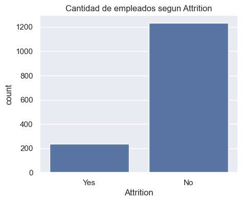
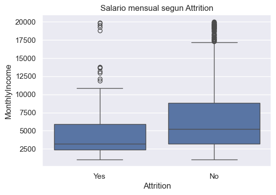
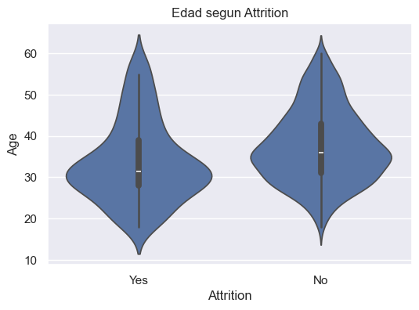
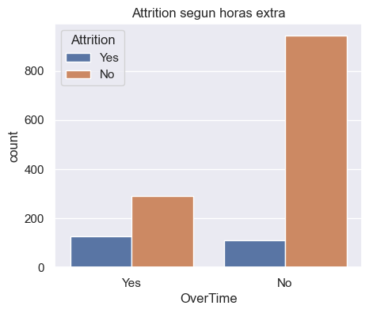
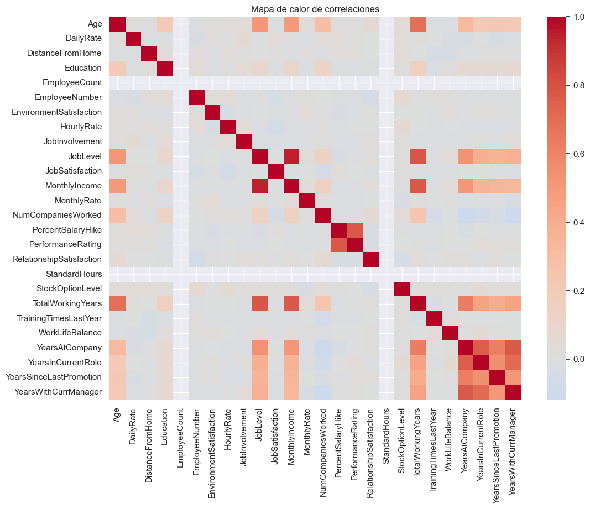
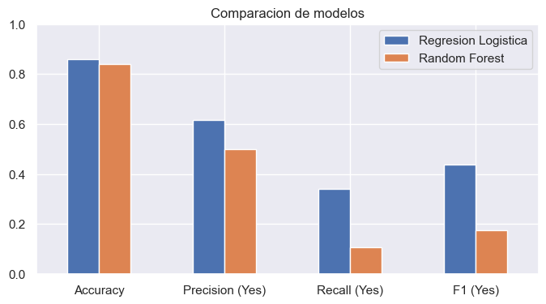
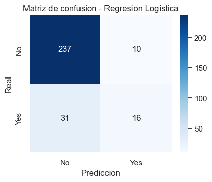
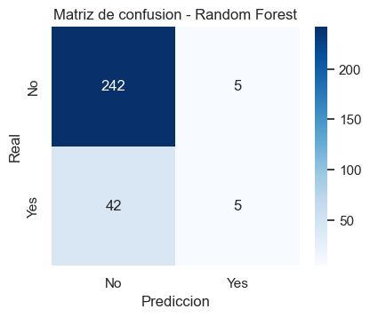
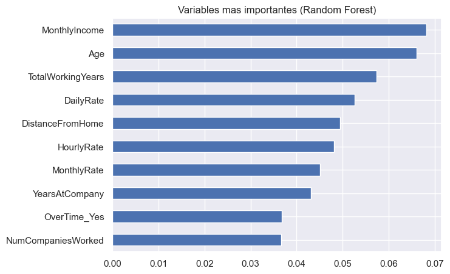

# Informe - Trabajo Final ICD 2026 (IBM HR Analytics)

## Que quise hacer

El objetivo del trabajo es predecir si un empleado se va de la empresa o no. Eso esta
en la columna `Attrition` (`Yes` = se fue, `No` = se quedo). Como ya tengo los datos
historicos con la respuesta, es un problema de clasificacion. Probe dos modelos:
**Regresion Logistica** y **Random Forest**.

Todo el codigo esta en el notebook `trabajo_final_icd_2026.ipynb`.

## Los datos

El dataset tiene 1470 filas y 35 columnas con datos de los empleados (edad, sueldo,
puesto, antiguedad, satisfaccion, etc.).

Lo primero que mire fue como esta repartida la variable que quiero predecir:

La mayoria de los empleados se queda: 1233 con `No` y solo 237 con `Yes` (un 16% mas o
menos). Esto es importante porque, si el dataset esta tan desbalanceado, un modelo
podria tener un accuracy alto simplemente diciendo casi siempre `No`. Por eso despues
no miro solo el accuracy, sino tambien que tan bien encuentra los casos `Yes`.

## Exploracion

Revise los valores faltantes y encontre tres columnas con datos vacios:

| Columna | Faltantes |
| --- | ---: |
| DistanceFromHome | 147 |
| DailyRate | 73 |
| Age | 44 |

Tambien vi que hay columnas que tienen siempre el mismo valor (`EmployeeCount`,
`StandardHours`, `Over18`) y una que es solo un numero de legajo (`EmployeeNumber`).
Esas no sirven para predecir, asi que las saco mas adelante.

Despues hice algunos graficos para entender los datos.

**Salario segun si se fue o no (boxplot):**

Los que se fueron tienden a tener sueldos mas bajos: su caja esta mas abajo que la de
los que se quedaron.

**Edad segun si se fue o no (violin):**

Los que se van suelen ser mas jovenes, se concentran mas cerca de los 30 anios.

**Attrition segun horas extra:**

Los empleados que hacen horas extra se van bastante mas seguido que los que no.

**Mapa de calor de correlaciones:**

Sirve para ver que variables se relacionan entre si. Por ejemplo, las variables de
antiguedad (anios en la empresa, en el puesto, con el jefe) estan relacionadas entre
ellas, y el sueldo va de la mano de la experiencia total. Igual, que dos cosas vayan
juntas no quiere decir que una cause la otra, es solo lo que muestran los datos.

## Preparacion de los datos

Antes de entrenar hice:

- Saque las columnas que no aportan (las constantes y el legajo).
- Rellene los faltantes de las columnas numericas con la **mediana**.
- Pase `Attrition` a numero (`No = 0`, `Yes = 1`).
- Convirti las columnas de texto en columnas 0/1 con `get_dummies`.
- Divido en entrenamiento (80%) y prueba (20%), con `stratify` para mantener la misma
  proporcion de `Yes`/`No` en las dos partes.
- Escale las variables numericas con `StandardScaler`.

## Modelos y resultados

Entrene los dos modelos y los evalue sobre el conjunto de prueba (294 empleados, de los
cuales 47 eran `Yes`). Estas fueron las metricas:

| Metrica | Regresion Logistica | Random Forest |
| --- | ---: | ---: |
| Accuracy | 0.8605 | 0.8401 |
| Precision (Yes) | 0.6154 | 0.5000 |
| Recall (Yes) | 0.3404 | 0.1064 |
| F1 (Yes) | 0.4384 | 0.1754 |

Las matrices de confusion muestran en que se equivoca cada modelo (las filas son el
valor real y las columnas lo que predijo el modelo):

La Regresion Logistica acerto 253 de los 294 casos. De los 47 empleados que realmente
se fueron, detecto 16. No es mucho, pero es el modelo que mas encontro.

El Random Forest acerto 247 de 294, pero de los 47 que se fueron solo detecto 5. Casi
siempre predice `No`.

Lo interesante es que los dos modelos tienen un accuracy parecido y bastante alto (84-86%),
pero eso es en gran parte porque la mayoria de los empleados son `No`. Cuando miro el
**recall de la clase `Yes`** (cuantos de los que se fueron logro encontrar), se nota que
los dos cuestan, y que la Regresion Logistica anda mejor (34% contra 10%).

## Variables mas importantes

El Random Forest tambien deja ver que variables pesan mas para decidir:

Las que mas influyen son el sueldo (`MonthlyIncome`), la edad (`Age`), los anios
trabajados (`TotalWorkingYears`), algunas tarifas y la distancia al trabajo
(`DistanceFromHome`). Tambien aparece `OverTime_Yes`, que coincide con lo que ya habia
visto en los graficos.

## Conclusion

Entrene y compare dos modelos para predecir la rotacion de empleados. La **Regresion
Logistica** fue mejor en todas las metricas: mas accuracy y, sobre todo, mejor recall y
F1 para la clase `Yes`, que es la que importa si la idea es anticipar renuncias.

De todas formas, ningun modelo detecta muy bien a los que se van. Eso pasa porque hay
pocos casos `Yes` (el dataset esta desbalanceado), asi que a los modelos les cuesta
aprender ese grupo.

Cosas que se podrian mejorar mas adelante:

- Probar tecnicas para datasets desbalanceados (por ejemplo, darle mas peso a la clase
  `Yes`).
- Ajustar los parametros de los modelos.
- Usar validacion cruzada para resultados mas estables.
